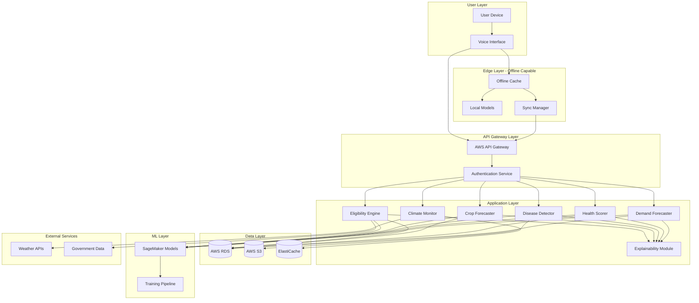

# Design Document: Rural AI Platform

## Overview

The Rural AI Platform is a comprehensive, cloud-native system designed to serve rural communities through an integrated suite of AI-powered services. The platform addresses the unique challenges of rural deployment including limited connectivity, low digital literacy, and multilingual requirements.

The system architecture follows a hybrid cloud-edge model where AI models and data are cached locally for offline operation, with periodic synchronization to AWS cloud infrastructure. The platform integrates seven core AI services: government scheme eligibility prediction, crop yield forecasting, disease detection, health risk scoring, climate monitoring, demand forecasting, and explainable AI.

Key architectural principles:
- **Offline-first**: All core functionality available without connectivity
- **Voice-first**: Primary interaction through speech in local languages
- **Explainability**: Every AI prediction accompanied by human-readable reasoning
- **Security**: End-to-end encryption with compliance to Indian data protection laws
- **Scalability**: Auto-scaling AWS infrastructure supporting millions of users

## Architecture

### High-Level Architecture



### Deployment Architecture

The platform uses a multi-tier AWS deployment:

1. **Edge Tier**: Progressive Web App (PWA) with service workers for offline caching
2. **API Tier**: AWS API Gateway + Lambda for serverless request handling
3. **Compute Tier**: ECS Fargate containers for stateless AI services
4. **Data Tier**: RDS PostgreSQL for structured data, S3 for images/models, ElastiCache for session data
5. **ML Tier**: SageMaker for model training and hosting

### Offline-First Strategy

The offline-first architecture uses a three-layer caching strategy:

1. **Model Cache**: Compressed TensorFlow Lite models (<100MB each) stored in IndexedDB
2. **Data Cache**: Last 30 days of user data and reference data in IndexedDB
3. **Request Queue**: Pending requests stored locally and synced when online

Synchronization protocol:
- **Optimistic UI**: Show results immediately using local models
- **Background Sync**: Use Service Worker Background Sync API
- **Conflict Resolution**: Last-write-wins with vector clocks for ordering
- **Delta Sync**: Only transfer changed data to minimize bandwidth

## Components and Interfaces

### 1. Voice Interface Component

**Responsibilities:**
- Speech-to-text conversion in 10+ Indian languages
- Text-to-speech output with adjustable speed
- Language detection and switching
- Audio feedback during processing

**Technology Stack:**
- Google Cloud Speech-to-Text API (online mode)
- Mozilla DeepSpeech (offline mode)
- Google Cloud Text-to-Speech API (online mode)
- eSpeak NG (offline mode)

**Interface:**
```typescript
interface VoiceInterface {
  // Convert speech to text
  transcribe(audio: AudioBuffer, language: Language): Promise<TranscriptionResult>
  
  // Convert text to speech
  synthesize(text: string, language: Language, speed: SpeechSpeed): Promise<AudioBuffer>
  
  // Detect language from audio
  detectLanguage(audio: AudioBuffer): Promise<Language>
  
  // Provide audio feedback
  playFeedback(feedbackType: FeedbackType): void
}

interface TranscriptionResult {
  text: string
  confidence: number
  language: Language
}

enum SpeechSpeed {
  SLOW = 0.75,
  NORMAL = 1.0,
  FAST = 1.25
}

enum FeedbackType {
  LISTENING,
  PROCESSING,
  ERROR,
  SUCCESS
}
```

### 2. Offline Cache Component

**Responsibilities:**
- Store models, data, and pending requests locally
- Manage cache size and eviction policies
- Provide fast local data access
- Track cache freshness

**Technology Stack:**
- IndexedDB for structured data storage
- Cache API for static assets
- LocalStorage for configuration

**Interface:**
```typescript
interface OfflineCache {
  // Store and retrieve models
  storeModel(modelId: string, modelData: ArrayBuffer): Promise<void>
  getModel(modelId: string): Promise<ArrayBuffer | null>
  
  // Store and retrieve data
  storeData(key: string, data: any, ttl: number): Promise<void>
  getData(key: string): Promise<any | null>
  
  // Queue management
  queueRequest(request: PendingRequest): Promise<void>
  getPendingRequests(): Promise<PendingRequest[]>
  clearRequest(requestId: string): Promise<void>
  
  // Cache management
  getCacheSize(): Promise<number>
  evictOldData(maxAge: number): Promise<void>
  clearCache(): Promise<void>
}

interface PendingRequest {
  id: string
  timestamp: number
  endpoint: string
  payload: any
  retryCount: number
}
```

### 3. Sync Manager Component

**Responsibilities:**
- Synchronize offline data with cloud when online
- Resolve conflicts between local and remote data
- Prioritize critical data synchronization
- Monitor connectivity status

**Technology Stack:**
- Service Worker Background Sync API
- WebSocket for real-time updates
- Vector clocks for conflict resolution

**Interface:**
```typescript
interface SyncManager {
  // Synchronization
  sync(): Promise<SyncResult>
  syncPriority(dataType: DataType): Promise<SyncResult>
  
  // Conflict resolution
  resolveConflict(local: any, remote: any, metadata: ConflictMetadata): any
  
  // Connectivity
  isOnline(): boolean
  onConnectivityChange(callback: (online: boolean) => void): void
  
  // Status
  getSyncStatus(): SyncStatus
}

interface SyncResult {
  success: boolean
  syncedItems: number
  conflicts: number
  errors: SyncError[]
}

interface ConflictMetadata {
  localTimestamp: number
  remoteTimestamp: number
  localVectorClock: VectorClock
  remoteVectorClock: VectorClock
}

enum DataType {
  CRITICAL,    // Health alerts, weather warnings
  HIGH,        // User predictions, scheme data
  NORMAL,      // Historical data
  LOW          // Analytics, logs
}
```

### 4. Eligibility Engine Component

**Responsibilities:**
- Predict government scheme eligibility
- Evaluate user data against scheme criteria
- Rank schemes by relevance
- Generate eligibility explanations

**Technology Stack:**
- Rule-based engine for deterministic criteria
- XGBoost for probabilistic scoring
- AWS Lambda for serverless execution

**Interface:**
```typescript
interface EligibilityEngine {
  // Predict eligibility
  predictEligibility(userData: UserProfile): Promise<EligibilityResult[]>
  
  // Get scheme details
  getSchemeDetails(schemeId: string): Promise<SchemeDetails>
  
  // Update scheme rules
  updateSchemeRules(schemeId: string, rules: SchemeRules): Promise<void>
}

interface UserProfile {
  age: number
  gender: Gender
  income: number
  landOwnership: number
  familySize: number
  caste: string
  location: Location
  occupation: string
}

interface EligibilityResult {
  schemeId: string
  schemeName: string
  eligible: boolean
  confidence: number
  explanation: string
  requiredDocuments: string[]
  applicationLink: string
}

interface SchemeRules {
  criteria: Criterion[]
  priority: number
  active: boolean
}
```

### 5. Crop Forecaster Component

**Responsibilities:**
- Predict crop yields based on multiple factors
- Incorporate weather, soil, and historical data
- Provide confidence intervals
- Generate forecast explanations

**Technology Stack:**
- LSTM neural networks for time-series forecasting
- Random Forest for feature importance
- AWS SageMaker for model hosting

**Interface:**
```typescript
interface CropForecaster {
  // Forecast yield
  forecastYield(cropData: CropData): Promise<YieldForecast>
  
  // Get historical yields
  getHistoricalYields(location: Location, cropType: CropType, years: number): Promise<HistoricalYield[]>
  
  // Update forecast with new data
  updateForecast(forecastId: string, newData: Partial<CropData>): Promise<YieldForecast>
}

interface CropData {
  cropType: CropType
  landArea: number
  soilType: SoilType
  soilPH: number
  soilNutrients: NutrientLevels
  irrigationType: IrrigationType
  seedVariety: string
  plantingDate: Date
  location: Location
  weatherData: WeatherData
}

interface YieldForecast {
  forecastId: string
  expectedYield: number
  unit: string
  confidenceInterval: [number, number]
  confidence: number
  topFactors: Factor[]
  explanation: string
  generatedAt: Date
}

interface Factor {
  name: string
  impact: number  // -1 to 1
  description: string
}
```

### 6. Disease Detector Component

**Responsibilities:**
- Classify crop and livestock diseases from images
- Provide treatment recommendations
- Validate image quality
- Generate detection explanations

**Technology Stack:**
- MobileNetV3 for image classification (optimized for mobile)
- TensorFlow Lite for offline inference
- AWS S3 for image storage
- AWS Rekognition for image quality validation

**Interface:**
```typescript
interface DiseaseDetector {
  // Detect disease from image
  detectDisease(image: ImageData, type: DetectionType): Promise<DiseaseDetection>
  
  // Validate image quality
  validateImage(image: ImageData): Promise<ImageValidation>
  
  // Get treatment recommendations
  getTreatment(diseaseId: string): Promise<TreatmentRecommendation>
}

interface ImageData {
  data: ArrayBuffer
  format: ImageFormat
  width: number
  height: number
  capturedAt: Date
}

interface DiseaseDetection {
  detectionId: string
  diseases: DiseaseResult[]
  imageQuality: number
  explanation: string
  confidence: number
}

interface DiseaseResult {
  diseaseId: string
  diseaseName: string
  probability: number
  severity: Severity
  affectedArea: BoundingBox
}

interface TreatmentRecommendation {
  diseaseId: string
  treatments: Treatment[]
  preventiveMeasures: string[]
  urgency: Urgency
}

enum DetectionType {
  CROP,
  LIVESTOCK
}

enum Severity {
  MILD,
  MODERATE,
  SEVERE
}
```

### 7. Health Scorer Component

**Responsibilities:**
- Assess health risks based on user inputs
- Score multiple health conditions
- Provide risk factor analysis
- Generate health recommendations

**Technology Stack:**
- Logistic regression for risk scoring
- SHAP for feature importance
- AWS RDS for health data storage (HIPAA-compliant configuration)

**Interface:**
```typescript
interface HealthScorer {
  // Calculate health risk scores
  calculateRiskScores(healthData: HealthData): Promise<HealthRiskResult>
  
  // Get risk factors
  getRiskFactors(condition: HealthCondition): Promise<RiskFactor[]>
  
  // Get recommendations
  getRecommendations(riskResult: HealthRiskResult): Promise<HealthRecommendation[]>
}

interface HealthData {
  age: number
  gender: Gender
  weight: number
  height: number
  bloodPressure: BloodPressure
  bloodSugar: number
  symptoms: Symptom[]
  medicalHistory: MedicalCondition[]
  lifestyle: LifestyleFactors
}

interface HealthRiskResult {
  assessmentId: string
  overallRisk: RiskLevel
  conditionScores: ConditionScore[]
  riskFactors: RiskFactor[]
  explanation: string
  assessedAt: Date
}

interface ConditionScore {
  condition: HealthCondition
  score: number  // 0-100
  riskLevel: RiskLevel
  confidence: number
}

enum RiskLevel {
  LOW,
  MODERATE,
  HIGH,
  CRITICAL
}

enum HealthCondition {
  DIABETES,
  HYPERTENSION,
  MALNUTRITION,
  RESPIRATORY,
  CARDIOVASCULAR,
  ANEMIA,
  TUBERCULOSIS,
  KIDNEY_DISEASE,
  LIVER_DISEASE,
  THYROID
}
```

### 8. Climate Monitor Component

**Responsibilities:**
- Aggregate climate and groundwater data
- Provide weather forecasts
- Send extreme weather alerts
- Track environmental trends

**Technology Stack:**
- AWS ElastiCache for fast data access
- Integration with IMD (India Meteorological Department) APIs
- Integration with CGWB (Central Ground Water Board) data
- AWS SNS for alert notifications

**Interface:**
```typescript
interface ClimateMonitor {
  // Get current weather
  getCurrentWeather(location: Location): Promise<WeatherData>
  
  // Get weather forecast
  getForecast(location: Location, days: number): Promise<WeatherForecast[]>
  
  // Get groundwater data
  getGroundwaterLevel(location: Location): Promise<GroundwaterData>
  
  // Subscribe to alerts
  subscribeToAlerts(location: Location, alertTypes: AlertType[]): Promise<string>
  
  // Get historical climate data
  getHistoricalData(location: Location, startDate: Date, endDate: Date): Promise<ClimateData[]>
}

interface WeatherData {
  temperature: number
  humidity: number
  rainfall: number
  windSpeed: number
  windDirection: number
  pressure: number
  timestamp: Date
}

interface WeatherForecast {
  date: Date
  temperatureMin: number
  temperatureMax: number
  rainfallProbability: number
  expectedRainfall: number
  conditions: WeatherCondition
  confidence: number
}

interface GroundwaterData {
  level: number  // meters below ground
  quality: WaterQuality
  trend: Trend
  lastUpdated: Date
  historicalAverage: number
}

enum AlertType {
  EXTREME_HEAT,
  HEAVY_RAIN,
  DROUGHT,
  FLOOD,
  STORM,
  FROST
}
```

### 9. Demand Forecaster Component

**Responsibilities:**
- Predict market demand for products
- Analyze seasonal patterns
- Identify demand drivers
- Provide pricing insights

**Technology Stack:**
- Prophet for time-series forecasting
- ARIMA for seasonal decomposition
- AWS SageMaker for model hosting

**Interface:**
```typescript
interface DemandForecaster {
  // Forecast demand
  forecastDemand(product: Product, horizon: ForecastHorizon): Promise<DemandForecast>
  
  // Get historical demand
  getHistoricalDemand(product: Product, period: TimePeriod): Promise<DemandData[]>
  
  // Get demand drivers
  getDemandDrivers(product: Product): Promise<DemandDriver[]>
  
  // Get pricing insights
  getPricingInsights(product: Product, forecast: DemandForecast): Promise<PricingInsight>
}

interface Product {
  productId: string
  name: string
  category: ProductCategory
  location: Location
}

interface DemandForecast {
  forecastId: string
  product: Product
  horizon: ForecastHorizon
  predictions: DemandPrediction[]
  confidence: number
  drivers: DemandDriver[]
  explanation: string
}

interface DemandPrediction {
  date: Date
  expectedDemand: number
  confidenceInterval: [number, number]
  seasonalFactor: number
}

interface DemandDriver {
  factor: string
  impact: number
  description: string
}

enum ForecastHorizon {
  ONE_WEEK,
  ONE_MONTH,
  THREE_MONTHS
}
```

### 10. Explainability Module Component

**Responsibilities:**
- Generate human-readable explanations for all AI predictions
- Translate technical model outputs to simple language
- Provide multilingual explanations
- Support different explanation depths

**Technology Stack:**
- SHAP (SHapley Additive exPlanations) for model interpretation
- LIME (Local Interpretable Model-agnostic Explanations) as fallback
- Template-based natural language generation
- AWS Translate for multilingual support

**Interface:**
```typescript
interface ExplainabilityModule {
  // Generate explanation
  explain(prediction: Prediction, depth: ExplanationDepth): Promise<Explanation>
  
  // Translate explanation
  translateExplanation(explanation: Explanation, language: Language): Promise<Explanation>
  
  // Get feature importance
  getFeatureImportance(prediction: Prediction): Promise<FeatureImportance[]>
}

interface Prediction {
  predictionId: string
  modelType: ModelType
  input: any
  output: any
  confidence: number
  modelVersion: string
}

interface Explanation {
  explanationId: string
  summary: string
  topFactors: ExplanationFactor[]
  detailedReasoning: string
  language: Language
  depth: ExplanationDepth
}

interface ExplanationFactor {
  factor: string
  contribution: number  // -1 to 1
  description: string
  userFriendlyName: string
}

enum ExplanationDepth {
  SIMPLE,      // 1-2 sentences
  MODERATE,    // 3-5 factors with descriptions
  DETAILED     // Full reasoning with all factors
}

enum ModelType {
  ELIGIBILITY,
  CROP_YIELD,
  DISEASE,
  HEALTH_RISK,
  DEMAND
}
```

### 11. Authentication Service Component

**Responsibilities:**
- Manage user registration and authentication
- Support voice-based enrollment
- Handle biometric authentication
- Manage sessions and tokens
- Enforce access control

**Technology Stack:**
- AWS Cognito for user management
- JWT for token-based authentication
- AWS KMS for key management
- Biometric APIs (WebAuthn)

**Interface:**
```typescript
interface AuthenticationService {
  // User registration
  registerUser(userData: RegistrationData): Promise<User>
  
  // Authentication
  authenticate(credentials: Credentials): Promise<AuthToken>
  authenticateBiometric(biometricData: BiometricData): Promise<AuthToken>
  authenticateVoice(voiceSample: AudioBuffer): Promise<AuthToken>
  
  // Session management
  refreshToken(refreshToken: string): Promise<AuthToken>
  logout(token: string): Promise<void>
  
  // Access control
  checkPermission(token: string, resource: string, action: Action): Promise<boolean>
}

interface RegistrationData {
  phoneNumber: string
  name: string
  voiceSample: AudioBuffer
  biometricData?: BiometricData
  location: Location
  preferredLanguage: Language
}

interface User {
  userId: string
  phoneNumber: string
  name: string
  location: Location
  preferredLanguage: Language
  createdAt: Date
  roles: Role[]
}

interface AuthToken {
  accessToken: string
  refreshToken: string
  expiresIn: number
  tokenType: string
}

enum Action {
  READ,
  WRITE,
  DELETE,
  ADMIN
}
```

## Data Models

### User Data Model

```typescript
interface UserProfile {
  userId: string
  phoneNumber: string
  name: string
  age: number
  gender: Gender
  location: Location
  preferredLanguage: Language
  occupation: string
  
  // Agricultural data
  landOwnership: number
  crops: CropInfo[]
  livestock: LivestockInfo[]
  
  // Economic data
  income: number
  familySize: number
  
  // Health data (encrypted)
  healthProfile: HealthProfile
  
  // Preferences
  notificationPreferences: NotificationPreferences
  privacySettings: PrivacySettings
  
  // Metadata
  createdAt: Date
  lastActive: Date
  deviceInfo: DeviceInfo
}

interface Location {
  latitude: number
  longitude: number
  district: string
  state: string
  pincode: string
  village: string
}

interface CropInfo {
  cropType: CropType
  landArea: number
  currentSeason: string
}

interface LivestockInfo {
  animalType: AnimalType
  count: number
}
```

### Prediction Data Model

```typescript
interface PredictionRecord {
  predictionId: string
  userId: string
  predictionType: PredictionType
  input: any
  output: any
  confidence: number
  explanation: Explanation
  modelVersion: string
  createdAt: Date
  feedback?: UserFeedback
}

interface UserFeedback {
  rating: number  // 1-5
  accurate: boolean
  comments: string
  submittedAt: Date
}

enum PredictionType {
  ELIGIBILITY,
  CROP_YIELD,
  DISEASE,
  HEALTH_RISK,
  DEMAND
}
```

### Sync Data Model

```typescript
interface SyncRecord {
  syncId: string
  userId: string
  deviceId: string
  syncType: SyncType
  dataType: DataType
  localVersion: number
  remoteVersion: number
  vectorClock: VectorClock
  status: SyncStatus
  conflictResolution?: ConflictResolution
  createdAt: Date
  completedAt?: Date
}

interface VectorClock {
  [deviceId: string]: number
}

enum SyncType {
  PUSH,
  PULL,
  BIDIRECTIONAL
}

enum SyncStatus {
  PENDING,
  IN_PROGRESS,
  COMPLETED,
  FAILED,
  CONFLICT
}
```

### Model Metadata

```typescript
interface ModelMetadata {
  modelId: string
  modelType: ModelType
  version: string
  accuracy: number
  size: number  // bytes
  framework: string
  trainingDate: Date
  deploymentDate: Date
  active: boolean
  offlineCapable: boolean
  supportedLanguages: Language[]
}
```

## Data Storage Strategy

### AWS RDS (PostgreSQL)
- User profiles and authentication data
- Scheme rules and eligibility criteria
- Historical predictions and feedback
- Sync records and conflict logs

### AWS S3
- Disease detection images
- ML model artifacts
- Training datasets
- Backup and archival data

### AWS ElastiCache (Redis)
- Session data
- Real-time weather data
- API response caching
- Rate limiting counters

### IndexedDB (Client-side)
- Offline model cache
- User data cache
- Pending request queue
- Configuration and preferences

## Security Architecture

### Data Encryption

**In Transit:**
- TLS 1.3 for all API communications
- Certificate pinning for mobile apps
- VPN for admin access

**At Rest:**
- AES-256 encryption for all databases
- S3 server-side encryption (SSE-KMS)
- Encrypted IndexedDB using Web Crypto API

### Access Control

**Authentication Layers:**
1. Primary: Voice biometric + PIN
2. Secondary: Device fingerprinting
3. Tertiary: SMS OTP for sensitive operations

**Authorization:**
- Role-Based Access Control (RBAC)
- Attribute-Based Access Control (ABAC) for health data
- Principle of least privilege

### Compliance

**Indian Regulations:**
- Digital Personal Data Protection Act (DPDPA) compliance
- Data localization (all data stored in AWS India regions)
- Right to erasure implementation
- Consent management system

**Healthcare:**
- HIPAA-equivalent controls for health data
- Audit logging for all health data access
- De-identification for analytics

### Security Monitoring

- AWS GuardDuty for threat detection
- AWS WAF for API protection
- CloudTrail for audit logging
- Automated vulnerability scanning
- Penetration testing quarterly

## Scalability Design

### Auto-Scaling Configuration

**ECS Services:**
- Target CPU utilization: 70%
- Target memory utilization: 80%
- Scale-out: Add 2 tasks when threshold exceeded for 2 minutes
- Scale-in: Remove 1 task when below threshold for 5 minutes
- Min tasks: 2 per service
- Max tasks: 50 per service

**Lambda Functions:**
- Concurrent executions: 1000 reserved
- Provisioned concurrency: 10 for critical functions
- Timeout: 30 seconds (API), 15 minutes (batch)

**Database:**
- RDS read replicas: 3 (one per AZ)
- Connection pooling: PgBouncer
- Auto-scaling storage: Enabled
- Performance Insights: Enabled

### Caching Strategy

**Multi-Level Caching:**
1. **Client Cache**: 30 days of data in IndexedDB
2. **CDN Cache**: Static assets via CloudFront (24 hour TTL)
3. **API Cache**: ElastiCache for frequent queries (1 hour TTL)
4. **Database Cache**: RDS query cache

**Cache Invalidation:**
- Time-based expiration
- Event-driven invalidation for critical updates
- Manual purge capability for admins

### Load Distribution

**Geographic Distribution:**
- Multi-region deployment (Mumbai, Hyderabad)
- Route 53 latency-based routing
- CloudFront edge locations across India

**Request Distribution:**
- Application Load Balancer with path-based routing
- Weighted target groups for canary deployments
- Health checks every 30 seconds

## Performance Optimization

### Model Optimization

**Compression:**
- Quantization: INT8 for inference (4x size reduction)
- Pruning: Remove 30% of weights with minimal accuracy loss
- Knowledge distillation: Teacher-student models

**Inference Optimization:**
- Batch prediction for multiple requests
- Model caching in memory
- GPU acceleration for online inference
- CPU-optimized models for offline

### Network Optimization

**Bandwidth Reduction:**
- Gzip compression for API responses
- WebP format for images
- Delta sync for data updates
- Request deduplication

**Latency Reduction:**
- HTTP/2 for multiplexing
- Connection keep-alive
- DNS prefetching
- Resource hints (preload, prefetch)

### Database Optimization

**Query Optimization:**
- Indexed columns for frequent queries
- Materialized views for complex aggregations
- Partitioning for large tables (by date)
- Query result caching

**Connection Management:**
- Connection pooling (min: 10, max: 100)
- Prepared statements
- Read/write splitting

